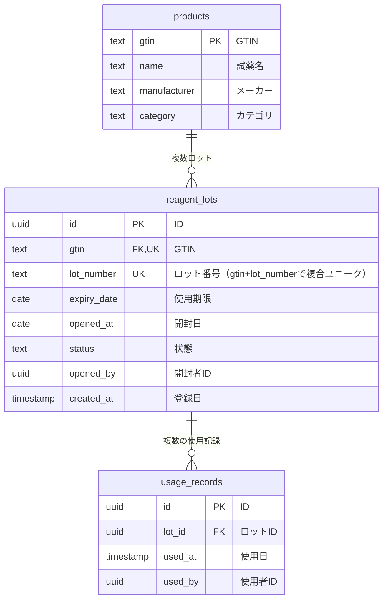

```mermaid
erDiagram
    products ||--o{ reagent_lots : "複数ロット"
    reagent_lots ||--o{ usage_records : "複数の使用記録"
    products {
        text gtin PK "GTIN"
        text name "試薬名"
        text manufacturer "メーカー"
        text category "カテゴリ"
    }
    reagent_lots {
        uuid id PK "ID"
        text gtin FK,UK "GTIN"
        text lot_number UK "ロット番号（gtin+lot_numberで複合ユニーク）"
        date expiry_date "使用期限"
        date opened_at "開封日"
        text status "状態"
        uuid opened_by "開封者ID"
        timestamp created_at "登録日"
    }
    usage_records {
        uuid id PK "ID"
        uuid lot_id FK "ロットID"
        timestamp used_at "使用日"
        uuid used_by "使用者ID"
    }
```
